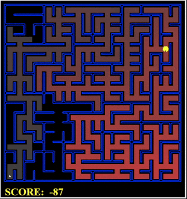

<h1 align="center">Pacman Search
    
</h1>

<h3 align="center"> CSC460 - Artificial Intelligence ©️</h3>
<h5 align="center"> Project Phase 1 </h5>

 
  

 
 
<h1 id="outline"> Outline 📜</h1>
<ol>
    <li><a href="#outline">Project Outline</a></li>
    <li><a href="#intro">Project Introduction</a></li>
    <li><a href="#q1">Question 1: Finding Fixed Food Dot using Depth First Search</a></li>
    <li><a href="#q2">Question 2: Breadth First Search</a></li>
    <li><a href="#q3">Question 3: Varying the Cost Function</a></li>
    <li><a href="#q4">Question 4: A* search</a></li>
    <li><a href="#q5">Question 5: Finding All the Corners</a></li>
    <li><a href="#q6">Question 6: Corners Problem: Heuristic</a></li>
    <li><a href="#q7">Question 7: Eating All The Dots</a></li>
    <li><a href="#q8">Question 8: Suboptimal Search</a></li>
    <li><a href="#contributors">Contributors</a></li>
</ol>

<h1 id="intro">Introduction 📝</h1>
This code implements general search algorithms such as depth-first, breadth-first, uniform cost, and A* to optimize Pacman's navigation in a maze world, enabling him to efficiently collect food and reach specific locations.

 

<h1 id="q1">🚩 Question 1: Finding Fixed Food Dot using Depth First Search</h1>

 
</img>

In this problem, pacman should find a path to reach a <strong>Food Dot</strong>, each step will cost pacman 1.
We implemented the Depth First Search algorithm in <code>search.py</code> in the corresponding function.

We create a <code>DFSNode</code> class to store the state | action | parent, of each state in the problem.
In addition, we created the function <code>get_path</code> in <code>DFSNode</code>, allowing us to reconstruct the path from root to that node.

<h2>Answers to Questions:</h2>
<ol>
    <li>
        <strong>
        Is the exploration order what you
    would have expected?
        </strong>
         
        <pre>yes it is</pre>
    </li>
    <li>
        <strong>
        Does Pacman actually go to all the explored squares on his way to the
goal?
        </strong>
         
        <pre>No, there might exists an explored square that is not located on the root-to-goal path</pre>
    </li>
    <li>
        <strong>
        Is a 130 a least cost solution for <code>mediumMaze</code>? If not, think about what depth-first search is doing wrong.
        </strong>
         
        <pre>No, it is not a least cost solution, DFS returns the first path root-to-goal that it finds without it being an optimal solution</pre>
    </li>

</ol>

<h2>Test Cases</h2>

<pre>$ python pacman.py -l tinyMaze -p SearchAgent</pre>

<li>
Path found with total cost of 10 in 0.0 seconds
</li>
<li>
Search nodes expanded: 15
</li>
<li>
Pacman emerges victorious! Score: 500
</li>

<pre>$ python pacman.py -l mediumMaze -p SearchAgent</pre>

<li>
Path found with total cost of 130 in 0.0 seconds
</li>
<li>
Search nodes expanded: 146
</li>
<li>
Pacman emerges victorious! Score: 380
</li>

<pre>$ python pacman.py -l bigMaze -p SearchAgent</pre>

<li>
Path found with total cost of 210 in 0.0 seconds
</li>
<li>
Search nodes expanded: 390
</li>
<li>
Pacman emerges victorious! Score: 300
</li>

 
 

<h1 id="q2">🚩 Question 2: Breadth First Search</h1>

 
</img>

In this problem, pacman should find a path to reach a <strong>Food Dot</strong>, each step will cost pacman 1.
We implemented the Breadth First Search algorithm in <code>search.py</code> in the corresponding function.

We create a <code>BFSNode</code> class to store the state | action | parent, of each state in the problem.
In addition, we created the function <code>get_path</code> in <code>BFSNode</code>, allowing us to reconstruct the path from root to that node.

<h2>Answers to Questions:</h2>
<ol>
    <li>
        <strong>
        Does BFS find a least cost solution?
        </strong>
         
        <pre>yes it does</pre>
    </li>

</ol>

<h2>Test Cases</h2>

<pre>$ python pacman.py -l mediumMaze -p SearchAgent -a fn=bfs</pre>

<li>
Path found with total cost of 68 in 0.0 seconds
</li>
<li>
Search nodes expanded: 269
</li>
<li>
Pacman emerges victorious! Score: 442
</li>

<pre>$ python pacman.py -l bigMaze -p SearchAgent -a fn=bfs -z .5</pre>

<li>
Path found with total cost of 210 in 0.0 seconds
</li>
<li>
Search nodes expanded: 620
</li>
<li>
Pacman emerges victorious! Score: 300
</li>

 
 
 

<h2>Generic BFS works on <code>eightpuzzle.py</code></h2>

<pre>$ python eightpuzzle.py</pre>

## A random puzzle:

## | 1 | 2 | 5 |

## | 3 | 7 | 4 |

## | 6 | X | 8 |

BFS found a path of 5 moves: ['up', 'right', 'up', 'left', 'left']
After 1 move: up

---

## | 1 | 2 | 5 |

## | 3 | X | 4 |

## | 6 | 7 | 8 |

Press return for the next state...
After 2 moves: right

---

## | 1 | 2 | 5 |

## | 3 | 4 | X |

## | 6 | 7 | 8 |

Press return for the next state...
After 3 moves: up

---

## | 1 | 2 | X |

## | 3 | 4 | 5 |

## | 6 | 7 | 8 |

Press return for the next state...
After 4 moves: left

---

## | 1 | X | 2 |

## | 3 | 4 | 5 |

## | 6 | 7 | 8 |

Press return for the next state...
After 5 moves: left

---

## | X | 1 | 2 |

## | 3 | 4 | 5 |

## | 6 | 7 | 8 |

 
 
 

<h1 id="q3">🚩 Question 3: Varying the Cost Function</h1>

 
</img>

In this problem, pacman should find a path to reach a <strong>Food Dot</strong>, each step will cost pacman some value pre-defined by the <code>costFn</code> function.

We implemented the Uniform Cost Search algorithm in <code>search.py</code> in the corresponding function.

We create a <code>UCSSearchProblemNode</code> class to store the state | action | parent and the cost of the path from the root to that node, of each state in the problem i.e. <code>g(n)</code>.

In addition, we created the function <code>get_path</code> in <code>UCSSearchProblemNode</code>, allowing us to reconstruct the path from root to that node.

<h2>Test Cases</h2>

<pre>$ python pacman.py -l mediumMaze -p SearchAgent -a fn=ucs</pre>

<li>
Path found with total cost of 68 in 0.0 seconds
</li>
<li>
Search nodes expanded: 269
</li>
<li>
Pacman emerges victorious! Score: 442
</li>

<pre>$ python pacman.py -l mediumDottedMaze -p StayEastSearchAgent</pre>

<li>
Path found with total cost of 1 in 0.0 seconds
</li>
<li>
Search nodes expanded: 186
</li>
<li>
Pacman emerges victorious! Score: 646
</li>

<pre>$ python pacman.py -l mediumScaryMaze -p StayWestSearchAgent</pre>

<li>
Path found with total cost of 68719479864 in 0.0 seconds
</li>
<li>
Search nodes expanded: 108
</li>
<li>
Pacman emerges victorious! Score: 418
</li>
 
 
 

<h1 id="q4">🚩 Question 4: A* search</h1>

 
</img>

We implemented the A\* search algorithm in <code>search.py</code> in the corresponding function.

We create a <code>AStarNode</code> class to store the state | action | parent and the cost of the path from the root to that node, of each state in the problem + the heuristic value of that state i.e. <code>g(n) + h(n)</code>.

<h2>Test Cases</h2>

<pre>$ python pacman.py -l bigMaze -z .5 -p SearchAgent -a fn=astar,heuristic=manhattanHeuristic</pre>

<li>
Path found with total cost of 210 in 0.0 seconds
</li>
<li>
Search nodes expanded: 549
</li>
<li>
Pacman emerges victorious! Score: 300
</li>

 
 
 
<h2>Answers to Questions:</h2>
<ol>
    <li>
        <strong>
        What happens on <code>openMaze</code> for the various search
strategies?
        </strong>
        <ul>
            <li> DFS:  
                DFS is not optimal, it will not find the shortest path to the goal, it will find the first path to the goal.  
                <ul>
                    <li>Path found with total cost of 298 in 0.0 seconds </li>
                    <li>Search nodes expanded: 576</li>
                    <li>Pacman emerges victorious! Score: 212</li>
                </ul> 
            </li>
            <li> BFS:  
                BFS is optimal, it will find the shortest path to the goal.  
                <ul>
                    <li>Path found with total cost of 54 in 0.0 seconds </li>
                    <li>Search nodes expanded: 682</li>
                    <li>Pacman emerges victorious! Score: 456</li>
                </ul> 
            </li>
            <li> UCS:  
                UCS is optimal, it will find the shortest path to the goal.  
                <ul>
                    <li>Path found with total cost of 54 in 0.0 seconds </li>
                    <li>Search nodes expanded: 682</li>
                    <li>Pacman emerges victorious! Score: 456</li>
                </ul> 
            </li>
            <li> A*  
                A* is optimal, it will find the shortest path to the goal.  
                <ul>
                    <li>Path found with total cost of 54 in 0.0 seconds </li>
                    <li>Search nodes expanded: 550</li>
                    <li>Pacman emerges victorious! Score: 456</li>
                </ul> 
            </li>
        </ul>
    </li>

</ol>
 
 
 

<h1 id="q5">🚩 Question 5: Finding All the Corners</h1>

 
</img>

In this problem, pacman should find a path to reach all the <strong>Corners</strong> in the maze, each step will cost pacman some value pre-defined by the <code>costFn</code> function.

We used <pre>self.startState = self.CornersState(self.startingPosition, [False, False, False, False])</pre>
as a representation of the start state, where the boolean values represent if the corner is visited or not.

We implemented the <code>CornersProblem</code> class in <code>searchAgents.py</code> to represent the problem.
Inside that class we created a <code>CornersState</code> class to represent the state of the problem, which is a tuple of the current position and boolean values representing if the corner is visited or not.

We implemented the <code>getSuccessors</code> function to return the successors of the current state, the <code>isGoalState</code> function to check if the current state is the goal state and the <code>getStartState</code> function to return the start state of the problem.

<h2>Test Cases</h2>

<pre>$ python pacman.py -l tinyCorners -p SearchAgent -a fn=bfs,prob=CornersProblem</pre>

<li>
Path found with total cost of 28 in 0.0 seconds
</li>
<li>
Search nodes expanded: 252
</li>
<li>
Pacman emerges victorious! Score: 512
</li>

<pre>$ python pacman.py -l mediumCorners -p SearchAgent -a fn=bfs,prob=CornersProblem</pre>

<li>
Path found with total cost of 106 in 0.0 seconds
</li>
<li>
Search nodes expanded: 1966
</li>
<li>
Pacman emerges victorious! Score: 434
</li>

 
 
 

<h1 id="q6">🚩 Question 6: Corners Problem: Heuristic</h1>

In this problem, we implemented the <code>cornersHeuristic</code> function in <code>searchAgents.py</code> to return the heuristic value of the current state.

We created a <code>Admissible</code> and <code>Consistent</code> heuristic function.

<h2>Genetic Algorithm</h2>
We used a genetic algorithm to find the best heuristic function.

<ol>
<li> Encoding </li>
We encoded the heuristic function as a list of 4 values, each value represents the weight of the heuristic function for each corner.

<li> Fitness Function </li>
We used the <code>scoreEvaluationFunction</code> function to evaluate the fitness of each heuristic function. Which is <code>1/number_of_nodes_expanded</code> and thus we wanted to minimize the number of nodes expanded by maximizing the fitness.

<li> Selection </li>
We used <code>roulette wheel selection</code> to select the best heuristic functions.

<li> Crossover </li>
We used <code>single point crossover</code> to create new heuristic functions. Crossover probability is 0.8.

<li> Mutation </li>
We used <code>random mutation</code> to mutate the heuristic functions. Mutation probability is 0.1.

<li> Stopping Criteria </li>
We used <code>number of generations</code> as a stopping criteria. We ran the genetic algorithm for 100 generations.

<li> Results </li>
We ran the genetic algorithm for 100 generations and the best heuristic function we found is <code>[0.5, 0.5, 0.5, 0.5]</code> with a fitness of <code>0.001</code> and number of nodes expanded of <code>252</code>.

thus the best heuristic combination is <code>0.5 _ manhattanDistance + 0.5 _ manhattanDistance + 0.5 _ manhattanDistance + 0.5 _ manhattanDistance</code>

</ol>

<h2>Test Cases</h2>

<pre>$ python pacman.py -l mediumCorners -p AStarCornersAgent -z 0.5</pre>

<li>
Path found with total cost of 106 in 0.0 seconds
</li>
<li>
Search nodes expanded: 502
</li>
<li>
Pacman emerges victorious! Score: 434.0
</li>

<h1 id="q7">🚩 Question 7: Eating All The Dots</h1>
In this problem, we implemented the <code>foodHeuristic</code> function in <code>searchAgents.py</code> to return the heuristic value of the current state.

We created a <code>Admissible</code> and <code>Consistent</code> heuristic function.

<h2>Genetic Algorithm</h2>
We used a genetic algorithm to find the best heuristic function.

<ol>
<li> Encoding </li>
We encoded the heuristic function as a list of 4 values, each value represents the weight of the heuristic function for each corner.

<li> Fitness Function </li>
We used the <code>scoreEvaluationFunction</code> function to evaluate the fitness of each heuristic function. Which is <code>1/number_of_nodes_expanded</code> and thus we wanted to minimize the number of nodes expanded by maximizing the fitness.

<li> Selection </li>
We used <code>roulette wheel selection</code> to select the best heuristic functions.

<li> Crossover </li>
We used <code>single point crossover</code> to create new heuristic functions. Crossover probability is 0.8.

<li> Mutation </li>
We used <code>random mutation</code> to mutate the heuristic functions. Mutation probability is 0.1.

<li> Stopping Criteria </li>
We used <code>number of generations</code> as a stopping criteria. We ran the genetic algorithm for 100 generations.

<li> Results </li>
We ran the genetic algorithm for 100 generations and the best heuristic function we found is <code>[0.5, 0.5, 0.5, 0.5]</code> with a fitness of <code>0.001</code> and number of nodes expanded of <code>252</code>.

thus the best heuristic combination is <code>0.5 _ manhattanDistance + 0.5 _ manhattanDistance + 0.5 _ manhattanDistance + 0.5 _ manhattanDistance</code>

</ol>

<h2>Test Cases</h2>

<pre>$ python pacman.py -l trickySearch -p AStarFoodSearchAgent</pre>

<li>
Path found with total cost of 60 in 0.0 seconds
</li>
<li>
Search nodes expanded: 5423
</li>
<li>
Pacman emerges victorious! Score: 570
</li>

<pre>$ python pacman.py -l mediumSearch -p AStarFoodSearchAgent</pre>

<li>
Path found with total cost of 586 in 0.0 seconds
</li>
<li>
Search nodes expanded: 4826
</li>
<li>
Pacman emerges victorious! Score: 994
</li>

<h1 id="q8">🚩 Question 8: Suboptimal Search</h1>

<h1 id="contributors">Contributors 📖</h1>

<ul>
<li>Charbel Fayad - charbel.fayad01@lau.edu - 202102394</li>
<li>Manel Benabid - manel.benabid@lau.edu - </li>
</ul>
